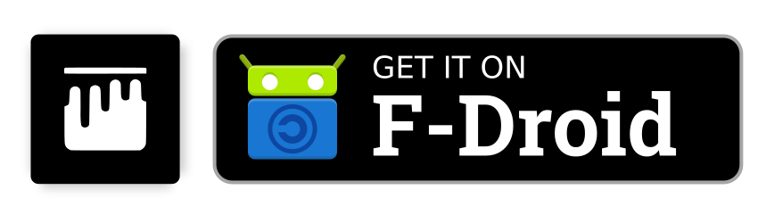

[](https://gitlab.com/xphnx/ameixa/-/commits/master)
[](https://f-droid.org/en/packages/org.xphnx.ameixa/)
[](https://xphnx.gitlab.io/ameixa/)

Two icon packs (chromatic and monochromatic) that are compatible with Trebuchet, Kiss Launcher, Lawnchair Launcher, OpenLauncher, Adw, and many more launchers (basically any launcher that supports icon packs).
It's a material design inspired theme that aims to provide a consistent and minimalistic look to your device.
Some code from the [Frost icon pack](https://github.com/dkanada/frost) is utilized (thank you dkanada!).
Mainly [F-Droid](https://f-droid.org/) hosted apps are supported. and only icon requests of FOSS apps are accepted.


# Download

## Ameixa
<a href="https://f-droid.org/packages/org.xphnx.ameixa">
    
</a>

## Ameixa Monochrome
<a href="https://f-droid.org/packages/org.xphnx.ameixamonochrome">
    
</a>

# Contributions are welcome :)

For requesting icons or contributing, please use the [Issue Tracker](https://gitlab.com/xphnx/ameixa/issues) or make a [Merge Request](https://gitlab.com/xphnx/ameixa/merge_requests)

Please run following command before pushing any commit. The output should be self explaining. Else, open an issue to get help.
```bash
$ ./check_icons.sh
```

## How To's

### Add a new icon
* Extract the activity name and add it in [appfilter.xml](https://gitlab.com/xphnx/ameixa/blob/master/app/src/main/res/xml/appfilter.xml) --> Use [Turtl](https://f-droid.org/packages/org.xphnx.iconsubmit) to find the activity name line
* Copy one of the [templates](https://gitlab.com/xphnx/ameixa/tree/master/other/templates) into the `todo` directory and create the new icon.

### An icon is not used after update
* Extract the new activity name and add it in [appfilter.xml](https://gitlab.com/xphnx/ameixa/blob/master/app/src/main/res/xml/appfilter.xml) --> Use [Turtl](https://f-droid.org/packages/org.xphnx.iconsubmit) to find the activity name line

### An icon is broken
* Copy the broken icon (here the icon is called `broken_app.svg`, to find the name check in the [appfilter.xml](https://gitlab.com/xphnx/ameixa/blob/master/app/src/main/res/xml/appfilter.xml)) from chromatic icon directory to todo:
`$ mv icons/chromatic/broken_app.svg todo/broken_app.svg`
* Delete old monochromatic icon:
`$ rm icons/monochromatic/broken_app.svg`
* Modify the icon in the `todo` directory and push changes.

### An icon is outdated
* Copy the old icon (here the icon is called `broken_app.svg`, to find the name check in the [appfilter.xml](https://gitlab.com/xphnx/ameixa/blob/master/app/src/main/res/xml/appfilter.xml)) from chromatic icon directory to the deprecated:
`$ mv icons/chromatic/broken_app.svg other/deprecated\ or\ old/broken_app.svg`
* Delete old monochromatic icon:
`$ rm icons/monochromatic/broken_app.svg`
* Copy one of the [templates](https://gitlab.com/xphnx/ameixa/tree/master/other/templates) into the `todo` directory and create the new icon.

## Tips for creating icons in Inkscape
You can be creative, the icon does not have to be a 1-to-1 clone of the original.
For many overloaded icons out there it is even beneficial to simplify them.

### Nameing an icon correctly
* the name should be in lower case
* The name should start with a character, **not** a digit

### General
* The icon should be white only without any transparency
* The icon should fit into **one** of the three hint outlines
* The icon should be vertically and horizontally aligned
* The minimum **gap** and **stroke width** is **0.6**

### Text, Gradients, Masks, etc.
* Use **Paths-objects only**
* Do not use any Text, Mask, etc. Instead, convert them as path via `Path>Stroke to Path` or `Path>Object to Path`

### Layers
* Do hide the `hint` layer after aligning the icon within the hint
* Do not rename any layer
* Do not change `background` layer
 Do not add additional layers

# Screenshots


# License


[GPLv3](https://www.gnu.org/licenses/gpl-3.0.html) and other libre / open licenses for the artwork
